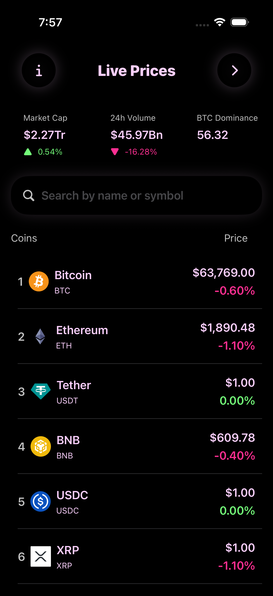
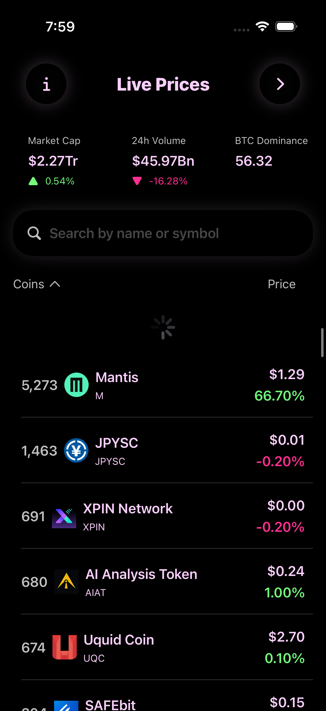
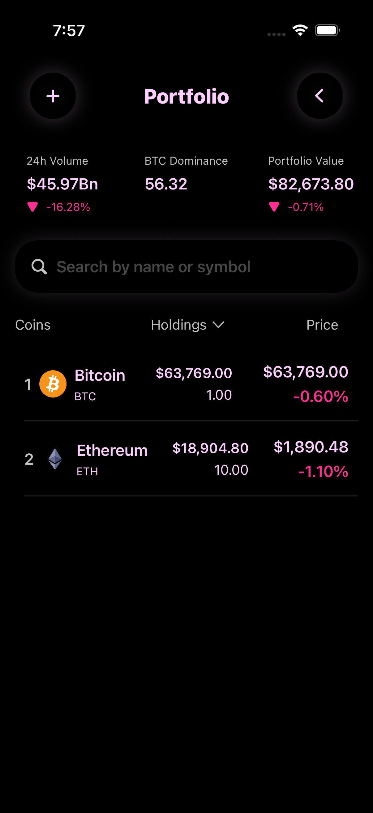
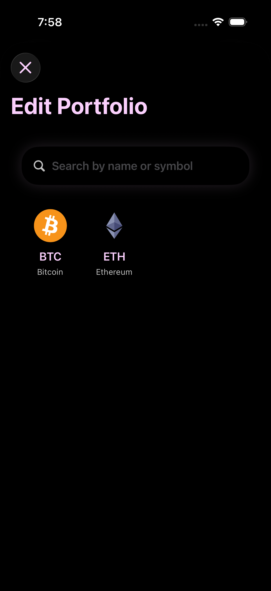
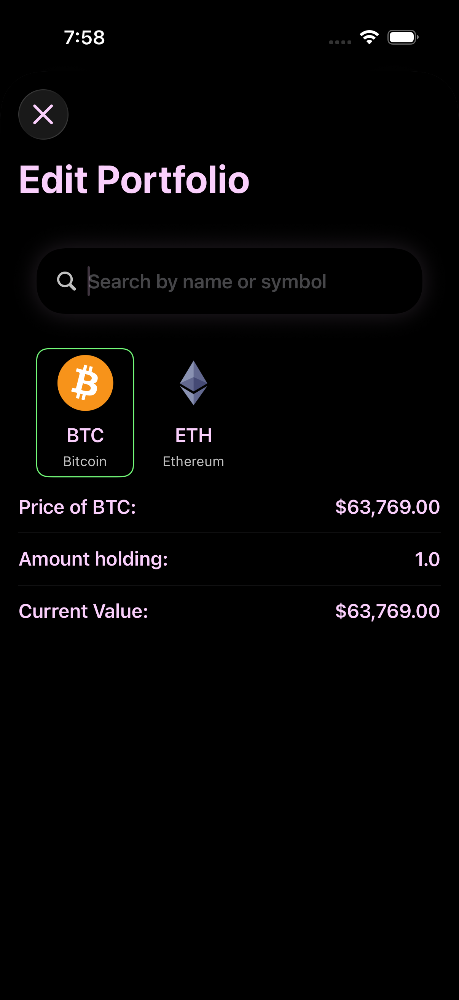
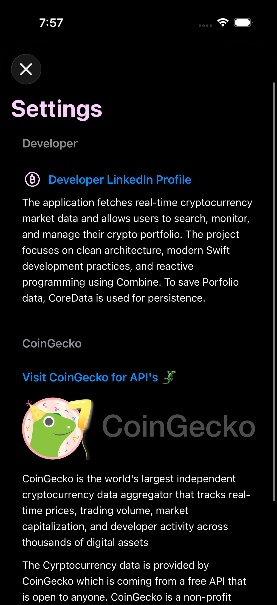

# Crypto Tracker

## Overview

Crypto Tracker is an iOS application built using **SwiftUI** and the **MVVM** architecture.

The application fetches real-time cryptocurrency market data and allows users to search, monitor, and manage their crypto portfolio. The project focuses on clean architecture, modern Swift development practices, and reactive programming using Combine.

---

## Architecture

The project follows the **MVVM (Model-View-ViewModel)** architecture.

This structure promotes separation of concerns, improves maintainability, and makes the application easier to test.

- **Model**
- **View**
- **ViewModel**
- **Services**

---

## Technical Highlights

### SwiftUI
Declarative UI built entirely with SwiftUI.

### Combine
Used for:
- Fetching API data
- Search functionality
- State management
- Reactive UI updates

### Core Data
Portfolio persistence across app launches.

### Generic Networking Layer
Reusable networking layer to fetch and decode any `Decodable` model.

### Dependency Injection
Injected dependencies for modularity and testability.

---

## Planned Screens

- Home
- Portfolio
- Coin Details
- Settings

---

## Project Structure

- **Core**
  - **Components**  
    Reusable SwiftUI views shared across the app.  
  - **Detail**  
    Coin detail feature, organized into Model, View, and ViewModel.  
  - **Home**  
    Home screen feature, also split into Model, View, and ViewModel.  

- **Helper**  
  Utility helpers for common tasks and app-wide support functions.  

- **Main**  
  Application entry point and lifecycle management.  

- **Services**
  - **Endpoints**  
    Defines API endpoints for cryptocurrency data.  
  - **Manager**  
    Networking and service managers to handle requests.  
  - **Service**  
    Core networking logic and reusable API layer.  

- **Utilities**
  - **Constants**  
    Centralized app-wide constant values.  
  - **Extension**  
    Swift extensions for reusable functionality.  
  - **Resources**  
    Assets, themes, and configuration files.  

- **Info.plist**  
  Supporting configuration for the application.  

---
## 🛠 Technologies

- **[SwiftUI](ca://s?q=Learn_about_SwiftUI)** → Declarative UI framework for building modern iOS apps  
- **[MVVM](ca://s?q=Explain_MVVM_architecture)** → Clean separation of concerns with Model, View, and ViewModel layers  
- **[Combine](ca://s?q=What_is_Combine_in_Swift)** → Reactive programming for data streams and UI updates  
- **[Core Data](ca://s?q=Core_Data_in_Swift)** → Local persistence for portfolio and offline support  
- **[URLSession](ca://s?q=URLSession_in_Swift)** → Networking layer for API requests  

---

## ⚙️ Requirements

- **Xcode 16+** → Latest IDE with SwiftUI/SwiftData support  
- **iOS 17+** → Minimum deployment target  
- **Swift 6** → Language version  

---

## 📸 Screenshots

  

    
    
Launch Screen

  

  

    
    
Home View

  

  

    
    
Refresh

  

  

    
    
Portfolio View

  

  

    
    
Edit Portfolio View

  

  

    
    
Add Coin Value

  

  

    
    
Settings View

  

---

## 🗺 Roadmap

- ✅ Custom Launch screen.
- ✅ Market screen  
- ✅ Search coins using Combine  
- ✅ Pull to refresh with haptic feedback  
- ✅ Coin detail screen  
- ✅ 7-day price chart  
- ✅ Portfolio  
- ✅ Add coins to portfolio  
- ✅ Edit portfolio holdings  
- ✅ Core Data persistence  
- ✅ Offline support for added portfolio coins 
- ✅ Image caching  
- ✅ Dark Mode  
- ✅ Settings page  

---

## 📝 Notes

This project is **fully completed**.

---

## 👨‍💻 Author

Developed by **Anurag**.

